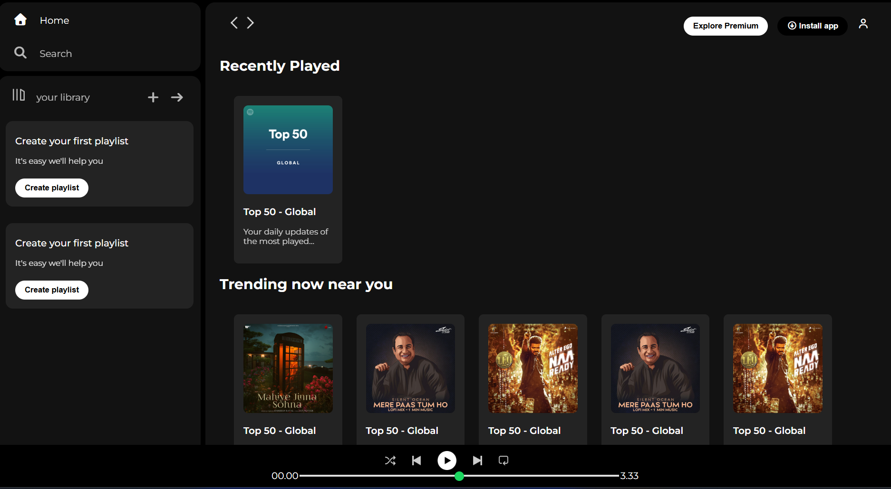

# Spotify Clone (HTML & CSS)

This is a **dummy Spotify webpage** built using only **HTML** and **CSS**.  
It is a static clone created for learning and practicing frontend design.

## Features
- Static UI similar to Spotify
- Responsive design (if applicable)
- Built using pure HTML & CSS (no JavaScript)

## Purpose
This project is for **practice only** and does not include real Spotify functionality.  

## Screenshot

## How to View
1. Clone the repository or download the ZIP.
2. Open `index.html` in your browser.

## Author
Santosh Kale
